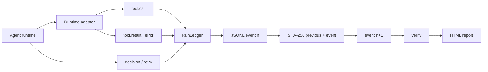

<p align="center">
  
</p>

<p align="center">
  <a href="https://github.com/yashkhou/runledger/actions/workflows/ci.yml"></a>
  <a href="https://github.com/yashkhou/runledger/releases/latest"></a>
  <a href="./LICENSE"></a>
  
  <a href="https://yashkhou.com/projects/runledger"></a>
</p>

<p align="center">
  <strong>A tamper-evident flight recorder for AI agent runs.</strong><br>
  RunLedger records tool calls, decisions, retries, results and evidence in an append-only JSONL hash chain—then verifies whether the history was altered.
</p>

<p align="center">
  <a href="https://yashkhou.com/projects/runledger"><strong>Project page</strong></a> ·
  <a href="./docs/real-report.html"><strong>Report fixture</strong></a> ·
  <a href="https://github.com/yashkhou/runledger/releases/latest"><strong>Latest release</strong></a>
</p>


## Policy gates for agent fleets

RunLedger can now enforce deterministic allow/deny policy against a recorded flight run before an autonomous agent result is accepted or promoted. Policies match event kind, actor and glob-style action names; explicit deny rules override allows, and `default: "deny"` enables allowlist mode.

```json
{
  "default": "deny",
  "rules": [
    { "id": "github-read", "effect": "allow", "kind": "tool_call", "action": "github.read.*" },
    { "id": "no-delete", "effect": "deny", "kind": "tool_call", "action": "*.delete" }
  ]
}
```

```bash
runledger policy-check runledger-flight.json policy.json
```

A clean run exits `0`; a violation exits `2` and prints the exact event sequence and rule ID. This turns the ledger from passive observability into a CI-capable execution contract for parallel coding agents.

## Signed execution attestations

RunLedger can bind a verified flight run and its policy decision into a portable Ed25519-signed attestation. The signed payload contains the run digest, final event hash, policy digest, policy outcome and violation count, so CI or a downstream system can verify exactly which evidence and policy were approved.

```bash
runledger attest run.json policy.json private.pem -o attestation.json --issuer github-ci
runledger attestation-verify attestation.json --run run.json --policy policy.json --public-key public.pem
```

Verification fails if the signature, run, policy, final chain head, or recomputed policy result no longer matches. Private keys are never embedded in the attestation; only the public key is portable.

## Why I built this

When an autonomous run fails, ordinary logs are often incomplete, mutable, or scattered across providers. RunLedger keeps a deliberately boring local record: one event per line, linked to the previous event by SHA-256, with a human-readable report when you need to inspect it.

## What ships today

- Append-only JSONL event ledger
- SHA-256 hash chain across every event
- Tool call, result, decision and retry events
- Tamper detection for edits, removals and reordering
- Human-readable HTML report
- Runtime adapter core with MCP JSON-RPC ingestion
- Deterministic allow/deny policy gates
- Portable Ed25519-signed run + policy attestations
- Zero database or hosted telemetry required

## Real demo


**[Inspect the verified report fixture →](./docs/real-report.html)**

## Quick start

```bash
git clone https://github.com/yashkhou/runledger.git
cd runledger
npm install
npm run build

node dist/cli.js add tool.call '{"name":"browser.open","url":"https://example.com"}'
node dist/cli.js add decision '{"choice":"verify","confidence":0.94}'
node dist/cli.js add tool.result '{"ok":true,"title":"Example Domain"}'
node dist/cli.js verify
node dist/cli.js report

# Convert an MCP JSON/JSONL transcript into a verified flight run
node dist/cli.js ingest mcp examples/mcp-session.jsonl -o mcp-flight.json
```

## Runtime ingestion

RunLedger v0.4 adds a small adapter contract so runtimes can translate their native events into the same tamper-evident flight format. MCP JSON-RPC is the first built-in adapter.

```ts
import { FlightRecorder, McpJsonRpcAdapter, ingestRuntime } from "runledger";

const recorder = new FlightRecorder();
const mcp = new McpJsonRpcAdapter();

ingestRuntime(recorder, mcp, {
  jsonrpc: "2.0",
  id: 1,
  method: "tools/call",
  params: { name: "browser.open", arguments: { url: "https://example.com" } },
});
```

The MCP adapter correlates `tools/call` request IDs with their JSON-RPC responses, preserving the originating tool name for both successful results and errors. It also accepts wrapped records such as `{ direction, message }` and JSON-RPC batches.

## Small example

```json
{
  "seq": 2,
  "type": "tool.result",
  "data": { "ok": true, "title": "Example Domain" },
  "previousHash": "ff0d9397…",
  "hash": "b14a4b94…"
}
```

## Architecture



The design rule is intentionally narrow: **the event ledger stays local, append-only and independently verifiable.**

## Good fits

- Debug autonomous workflows without depending on a SaaS console
- Keep provenance beside browser/computer-use runs
- Compare retry and decision behavior between agent versions
- Attach verifiable execution history to incidents and QA


## FAQ

### What is RunLedger?

RunLedger is a local TypeScript execution ledger for AI-agent runs. It stores structured events in JSONL and links them with SHA-256 so later tampering can be detected.

### What does tamper-evident mean?

Each event includes the previous event hash. Editing, deleting or reordering recorded events breaks chain verification.

### Does RunLedger require a hosted observability service?

No. The core ledger, verification and HTML reporting workflow is local-first and does not require a database or SaaS telemetry backend.

### What can RunLedger record?

It can record tool calls, tool results, decisions, retries and other structured execution events from an autonomous workflow.

### Can it import MCP traffic?

Yes. The built-in MCP adapter ingests JSON-RPC `tools/call` requests and correlates their responses into tool-call, tool-result and error flight events. The CLI accepts JSON, JSON arrays and JSONL transcripts.

## Roadmap

- [ ] Optional Ed25519 signatures
- [ ] OpenTelemetry exporter
- [ ] Screenshot and file evidence manifests
- [ ] Diff reports between two runs
- [x] Runtime adapter core + MCP JSON-RPC adapter
- [ ] Additional runtime adapters (OpenTelemetry, agent SDKs)

## Related tools

- [BrowserProof](https://github.com/yashkhou/browserproof) - browser-state verification for AI agents and Playwright workflows.
- [RunLedger](https://github.com/yashkhou/runledger) - tamper-evident execution history for AI-agent runs.
- [ActionMesh](https://github.com/yashkhou/actionmesh) - typed action contracts for tools, HTTP and CLI.

## Development

```bash
npm install
npm test
npm run build
```

CI runs tests and the TypeScript build on every push and pull request.

## Project links

- **Docs source:** [docs/](docs/)
- **Project page:** https://yashkhou.com/projects/runledger
- **Source:** https://github.com/yashkhou/runledger
- **Author:** [Yash](https://github.com/yashkhou) / [@yashkhou](https://x.com/yashkhou)

## License

MIT. See [LICENSE](./LICENSE).


## Agent flight recorder

RunLedger now includes a vendor-neutral **flight recorder** for autonomous agent runs. It captures intent, decisions, tool calls/results, checkpoints, errors and recovery events in a tamper-evident chain, then supports verification, semantic run comparison and recovery from the last known-good checkpoint.

See [`docs/flight-recorder.md`](docs/flight-recorder.md).
