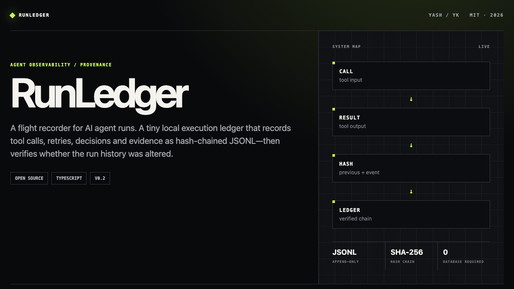
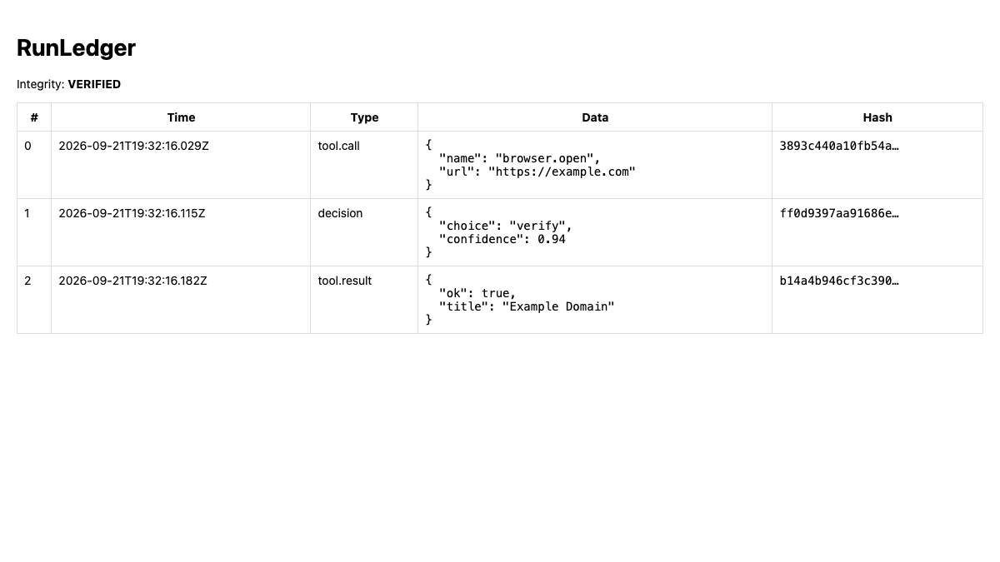
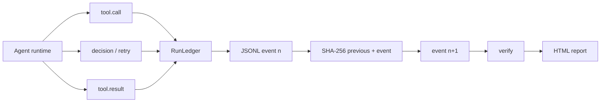
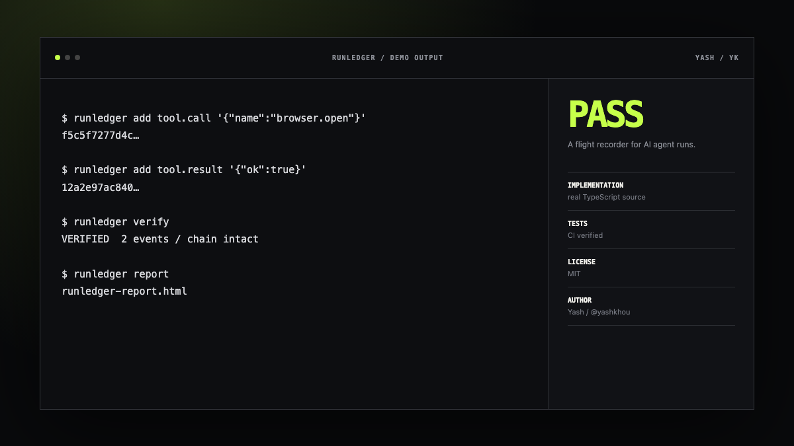

<p align="center">
  
</p>

<p align="center">
  <a href="https://github.com/yashkhou/runledger/actions/workflows/ci.yml"></a>
  <a href="https://github.com/yashkhou/runledger/releases/latest"></a>
  <a href="./LICENSE"></a>
  
  <a href="https://yashkhou.github.io/runledger/"></a>
</p>

<p align="center">
  <strong>A tamper-evident flight recorder for AI agent runs.</strong><br>
  RunLedger records tool calls, decisions, retries, results and evidence in an append-only JSONL hash chain—then verifies whether the history was altered.
</p>

<p align="center">
  <a href="https://yashkhou.github.io/runledger/"><strong>Live docs</strong></a> ·
  <a href="https://yashkhou.github.io/runledger/real-report.html"><strong>Open the real verified ledger report</strong></a> ·
  <a href="https://yashkhou.com/projects/runledger"><strong>Project page</strong></a> ·
  <a href="https://github.com/yashkhou/runledger/releases/latest"><strong>Latest release</strong></a>
</p>



## Why I built this

When an autonomous run fails, ordinary logs are often incomplete, mutable, or scattered across providers. RunLedger keeps a deliberately boring local record: one event per line, linked to the previous event by SHA-256, with a human-readable report when you need to inspect it.

## What ships today

- Append-only JSONL event ledger
- SHA-256 hash chain across every event
- Tool call, result, decision and retry events
- Tamper detection for edits, removals and reordering
- Human-readable HTML report
- Zero database or hosted telemetry required

## Real demo

This screenshot comes from the repository's executable demo—not a design mockup.



**[Open the real verified ledger report →](https://yashkhou.github.io/runledger/real-report.html)**

## Quick start

```bash
git clone https://github.com/yashkhou/runledger.git
cd runledger
npm install
npm run build

node dist/cli.js add tool.call '{"name":"browser.open","url":"https://example.com"}'
node dist/cli.js add decision '{"choice":"verify","confidence":0.94}'
node dist/cli.js add tool.result '{"ok":true,"title":"Example Domain"}'
node dist/cli.js verify
node dist/cli.js report
```

## Small example

```json
{
  "seq": 2,
  "type": "tool.result",
  "data": { "ok": true, "title": "Example Domain" },
  "previousHash": "ff0d9397…",
  "hash": "b14a4b94…"
}
```

## Architecture



The design rule is intentionally narrow: **the event ledger stays local, append-only and independently verifiable.**

## Good fits

- Debug autonomous workflows without depending on a SaaS console
- Keep provenance beside browser/computer-use runs
- Compare retry and decision behavior between agent versions
- Attach verifiable execution history to incidents and QA

## Visual system

The docs and repository assets are deliberately part of the project rather than generic GitHub decoration.



## Roadmap

- [ ] Optional Ed25519 signatures
- [ ] OpenTelemetry exporter
- [ ] Screenshot and file evidence manifests
- [ ] Diff reports between two runs
- [ ] Runtime adapters

## Development

```bash
npm install
npm test
npm run build
```

CI runs tests and the TypeScript build on every push and pull request.

## Project links

- **Docs:** https://yashkhou.github.io/runledger/
- **Portfolio:** https://yashkhou.com/projects/runledger
- **Source:** https://github.com/yashkhou/runledger
- **Author:** [Yash](https://github.com/yashkhou) / [@yashkhou](https://x.com/yashkhou)

## License

MIT. See [LICENSE](./LICENSE).
